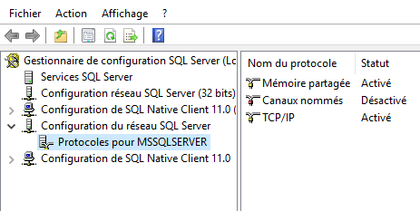
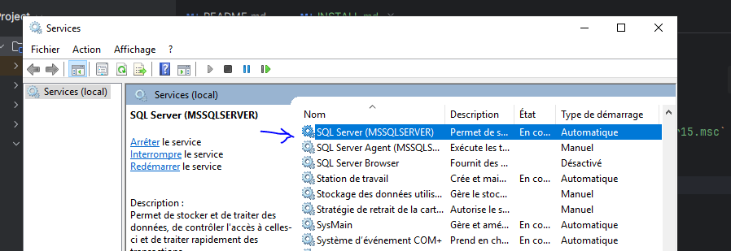

# Installation

## Base données

### Configuration de SQLSERVER pour accepter la connexion TCP/IP
- Ouvrir en mode administrateur `C:\Windows\SysWOW64\SQLServerManager15.msc`
- Activer le TCP/IP
- 
- Ouvrir `services.exe` 
- 
- Redemarrer le service SQLServer 

### Création et initialisation
Dans SSMS créer une base de données `bookhub` et importer le SQL [DDL.sql](./docs/database/MPD-DDL.sql)
