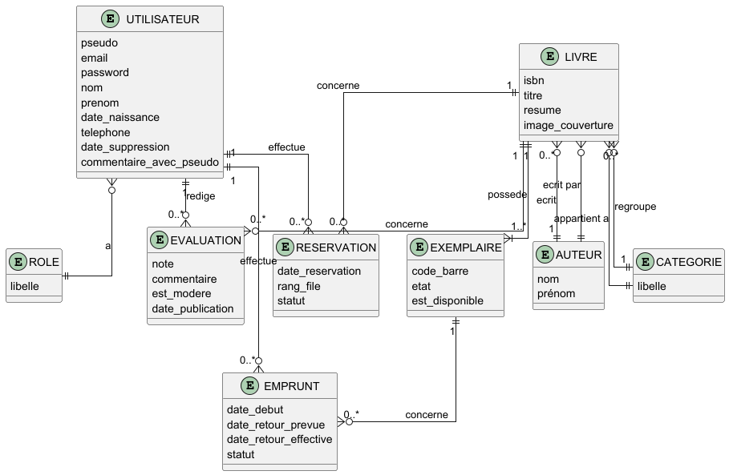
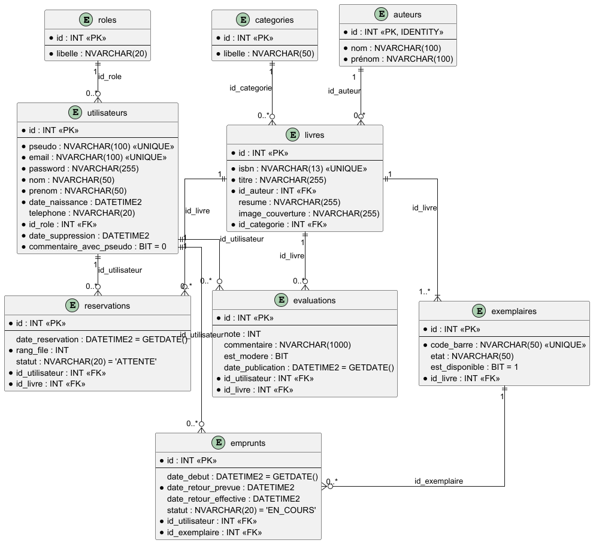
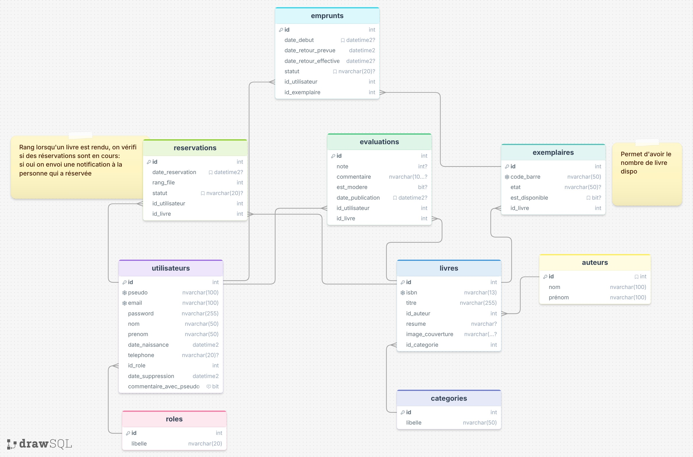

# Bookhub

# Navigation Utilisateur (Front)
[Navigation](./docs/Navigation.md)

## Cas utilisation

## Workflows
[Voir](./docs/workflow/README.md)

## Diagramme de classe
[Diagramme de classe](./docs/diagramme-classe/BookHub%20Diagramme%20de%20classe.drawio.pdf)

## Base de données

### MCD

### MLD

### MPD

### Maquette Figma
[https://www.figma.com/design/O7GgukhJnc4KSZXnldlAFu/Bookhub?node-id=2-11&t=qZekMwbmHz83quVZ-0](https://www.figma.com/design/O7GgukhJnc4KSZXnldlAFu/Bookhub?node-id=2-11&t=h2BnijZf2oSyHeq2-1)

## Infrastructure

